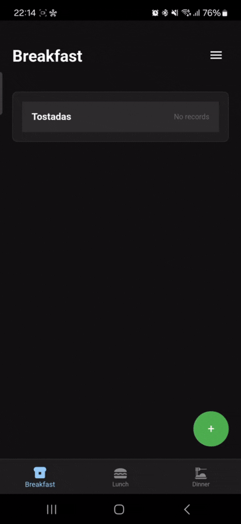

# Food Diary App

A mobile application to track your meals and their ingredients, built with React, TypeScript, and Capacitor.

## Description

Food Diary helps you keep track of when you eat specific meals and manage their ingredients. It's designed to help you maintain a record of your favorite meals and when you last had them.

## Features

- **Meal Organization**
  - Categorize meals into Breakfast, Lunch, and Dinner
  - Track dates for each meal
  - View meal history with dates

- **Ingredient Management**
  - Add ingredients with quantities
  - Specify where to buy each ingredient
  - Reorder ingredients via drag and drop

- **Customization**
  - Dark/Light theme
  - Sorting preferences
  - Language selection (EN/ES)

- **User Experience**
  - Responsive design
  - Offline support
  - Local data storage

## Technical Stack

- Frontend: React + TypeScript
- Native: Capacitor
- UI: Material-UI + Custom CSS
- i18n: React-Intl

## Preview



## Installation

1. Clone the repository
```bash
git clone https://github.com/yourusername/food-diary.git
cd food-diary
```

2. Install dependencies
```bash
npm install
```

3. Start development server
```bash
npm start
```

## Building for Production

### Web Build
```bash
npm run build
```

### Android Build
```bash
npx cap add android
npx cap sync
npx cap open android
```

> Note: App icons are already included in the repository. However, if you want to change them:
> 1. Generate new icons using [Icon Kitchen](https://icon.kitchen/)
> 2. Run the icons script:
>    ```bash
>    chmod +x move-icons.sh
>    ./move-icons.sh
>    ```

To generate the APK:
1. Open the project in Android Studio
2. Go to `Build > Build Bundle(s) / APK(s) > Build APK(s)`
3. The APK will be generated at:
   ```
   android/app/build/outputs/apk/debug/app-debug.apk
   ```

### iOS Build (untested)
```bash
npx cap add ios
npx cap sync
npx cap open ios
```

To generate the IPA:
1. Open the project in Xcode
2. Select your target device
3. Go to `Product > Archive`
4. Once archived, click `Distribute App`
5. The IPA will be generated at:
   ```
   ~/Library/Developer/Xcode/Archives/YYYY-MM-DD/App MM-DD-YY, HH.MM.xcarchive
   ```

> Note: iOS build hasn't been tested. You'll need:
> - macOS
> - Xcode installed
> - Apple Developer account
> - Proper certificates and provisioning profiles

## Usage

1. **Adding Meals**
   - Tap the + button
   - Enter meal name
   - Select category (Breakfast/Lunch/Dinner)

2. **Managing Meals**
   - Tap a meal to expand
   - Add dates when you eat it
   - Add/edit ingredients
   - View meal history

3. **Settings**
   - Access via menu button (top-right)
   - Toggle dark mode
   - Change sorting preferences

## Contributing

Pull requests are welcome. For major changes, please open an issue first to discuss what you would like to change.

## License

This project is licensed under the MIT License - see the LICENSE file for details.